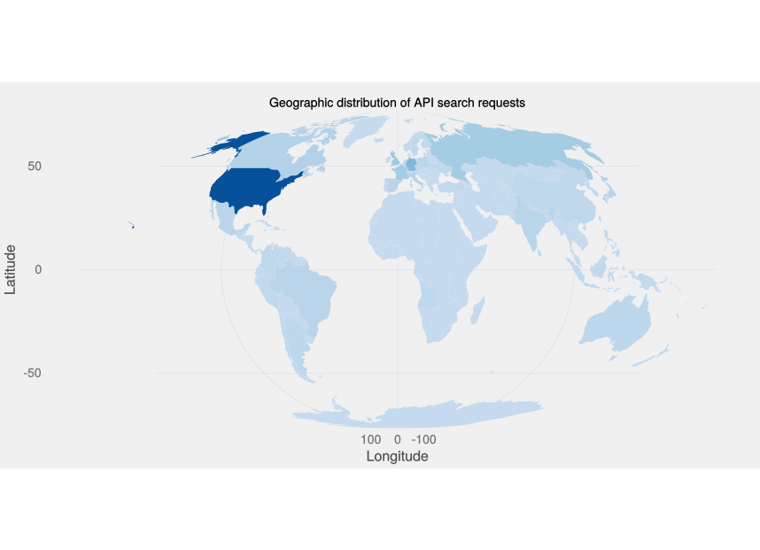
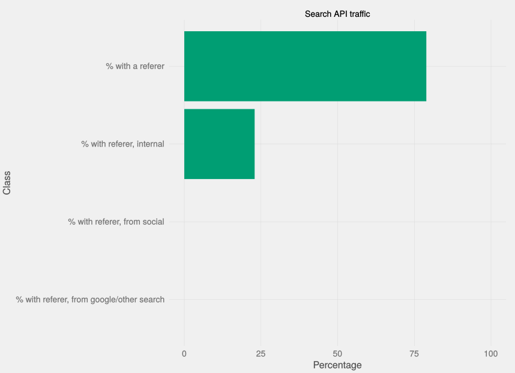
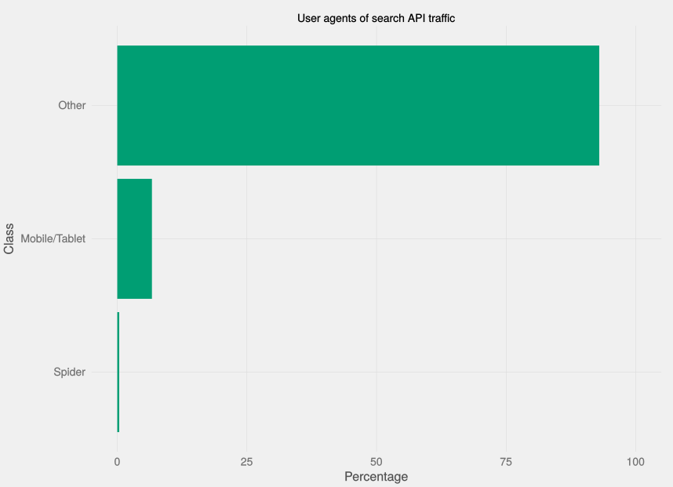
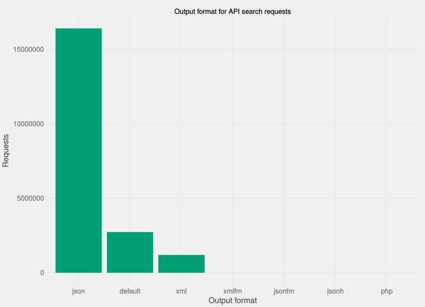
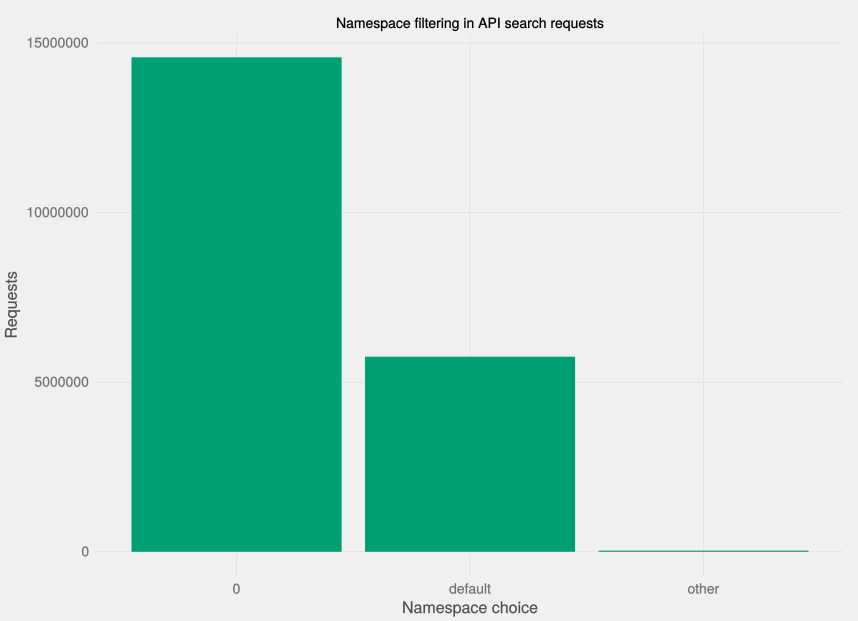

External Search API usage
========================================================
author: Oliver Keyes
date: 2015-05-20

By the numbers
========================================================
type: section

Search API usage:

* 4m an hour
* 97m a day
* 680m a week
* 20bn every 30 days!

Who uses it?
========================================================
type: section

Geography
========================================================

Referers
========================================================

Referers
========================================================

* What about the other 50% of requests?
* Third-party platforms (Wikipanion, mostly -41m every 30 days)
* Long tail

User agents
========================================================

* User agent parsing is hard and clumsy but we can do it
* "Only" 42,000 distinct user agents
* Can't identify "device class" so have to use some heuristics
* (Can dig into methodology if you'd like)

User agents
========================================================

User agents
========================================================

* From hand-coding:
* Recent Firefox (>37) /Chrome (>42), Safari browsers (integrated search?)
* 5m of the 20m requests are from Chrome 42, or something claiming to be it.
* "AppleDictionaryService"
* The Dreaded NativeHost

How do they use it?
========================================================
type: section

Output format
========================================================

Namespace options
========================================================

Conclusions
========================================================
type: section

* Lots of activity
* Most seems to be coming from browser search and maaaybe devices
* Dropin replacements for WP's interface potentially a big market now.
* Our defaults are the wrong defaults
